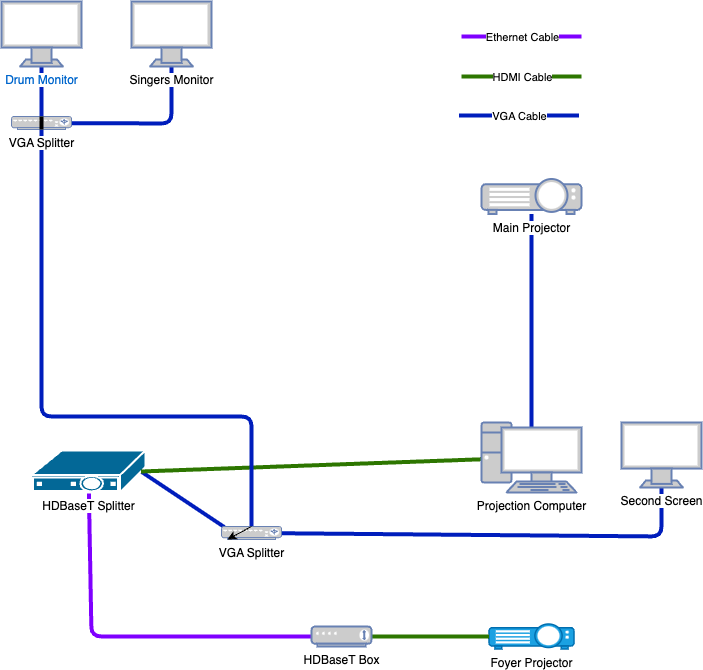

# Projection

## Background

We have brought two new projectors, one to replace the main projector in the main hall and one to go in the foyer. Along with these we have brought a [HDBaseT splitter](https://www.orei.com/products/uhd14-exb400k-ultrahd-hdmi-extender-splitter-over-cat-400feet) which will enable us to send the signal over standard ethernet cable. We are also planning on using this opportunity to switch to widescreen.

## Plan

The plan is to send the signal to all of the outputs via HDBaseT, see below diagram.

Currently we have:
- Installed the new projector in the main hall
- Installed the new projector in the foyer
- Setup HDBaseT to send the video signal to the foyer projector

## Issues

We have also encountered a few issues, including:
- The HDBaseT from our splitter doesn't seem to be compatible with the one in the Projector so we need to put one of the boxes up there
- If you try to duplicate a screen output on the computer to three physical outputs there are some weired issues with PowerPoint (this needed to be done in the NVIDIA control panel and there may be ways to get it to work).
- Both the drummers monitor and the main band monitor don't have HDMI inputs, but they do have DVI inputs

Because of the issues stated above, and because we haven't had time to put the scaffolding up to get to the main projector, we have had to have a couple of temporary setups. Currently the setup is as below, where we are still utilising VGA and VGA splitters a fair amount.

Dave has ordered some HDMI to DVI convertors and a HDMI splitter which should enable the setup below, where only the output to the main projector is via VGA.

## Tasks

The following tasks are still outstanding:
- [ ]  Fit HDBaseT box to main projector
- [ ]  Foyer screen
  - [ ]  Research screens for the foyer
  - [ ]  Order screen
  - [ ]  Fit screen
- [ ]  Main hall screen
  - [ ]  Look at whether a new screen is needed in the main hall (to enable switching to widescreen)
  - [ ]  Order screen?
  - [ ]  Fit screen?
- [ ]  Research different projection software